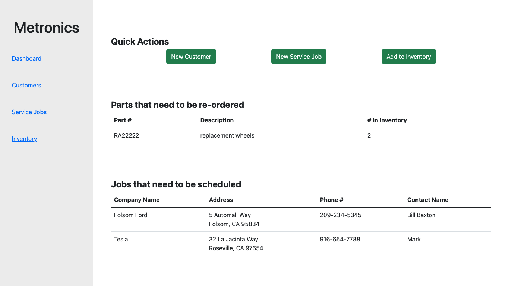
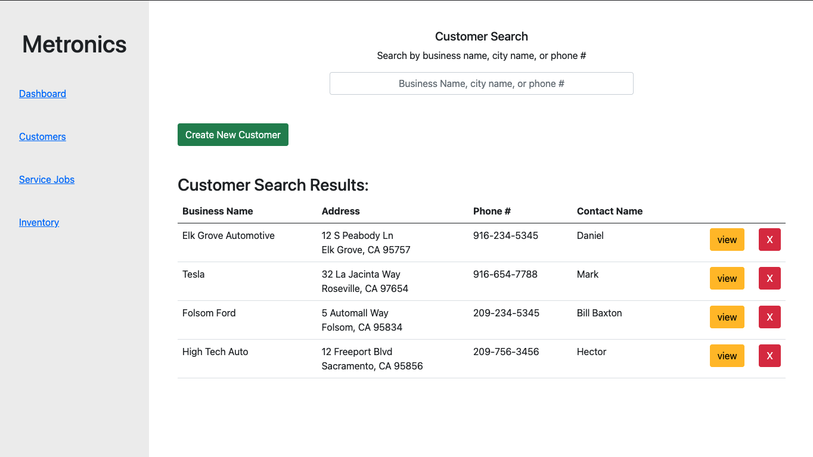
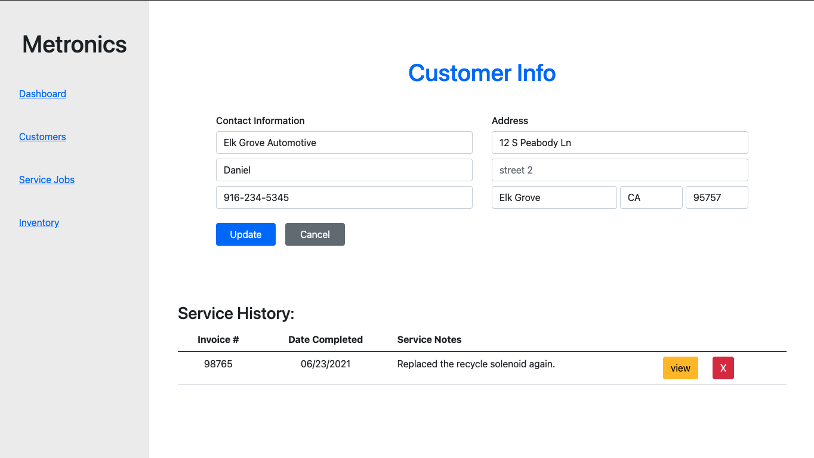
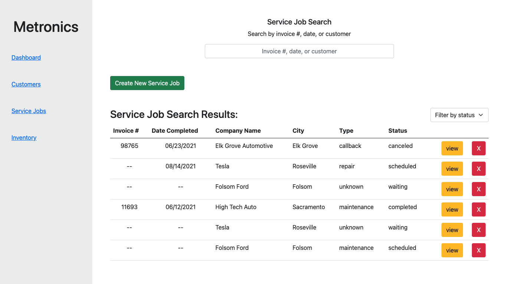
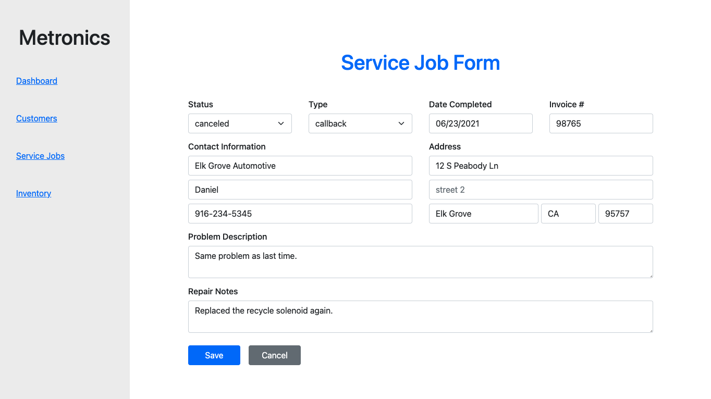
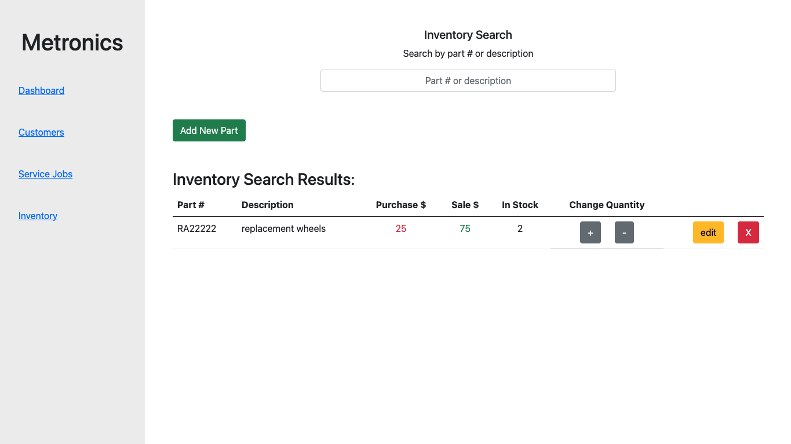

# Metronics, Inc

## Project Summary
This is a full stack application that was created for a real-world service company in the automotive industry. This application helps them to take their existing analog business and make it digital by allowing them to track customers, service jobs, and inventory via an online database. It was build using a microservice architecture to allow for greater flexibility and scalability as the business expands.

## Table of Contents:
* [Technologies Used](#technologies-used:)
* [Screenshots](#screenshots:)

## Technologies Used:
- [Java](https://go.java/?intcmp=gojava-banner-java-com)
- [Spring Framework](https://spring.io/projects/spring-framework)
- [React](https://reactjs.org/)
- [React-Query](https://react-query.tanstack.com/)
- [JavaScript](https://www.javascript.com/)
- [MySQL](https://www.mysql.com/)
- [JUnit](https://junit.org/junit4/)
- [Axios](https://axios-http.com/docs/intro)
- [HTML](https://developer.mozilla.org/en-US/docs/Web/HTML)
- [CSS](https://developer.mozilla.org/en-US/docs/Web/CSS)
- [Bootstrap](https://getbootstrap.com/)

## Screenshots:
After login, the Metronics user is greeted with an overview of their business operations. They take quick actions to add new customers, new service jobs, or parts to inventory. A filtered list of parts that are low in inventory is displayed so that they know what to re-order. They can also see any new service jobs that have yet to be contacted and scheduled.

___
At the customer screen, they can search for a specific customer and view or update their information.

When viewing an individual customer, they can also see a full history of jobs that they have completed for that customer. A feature that Metronics is very excited about.

___
At the service screen, they can view all of the service jobs that they have done, are doing, or will do for their customers. Being able to search through their service history by invoice #, date, and customer name with ease is an exciting new capability for the company.

They can select individual jobs where they can update both customer and job information all on one screen.

Gone are the days of manually searching through inventory to find out if they have the parts they need. Now they search through a database of parts to discover what they have in stock.
